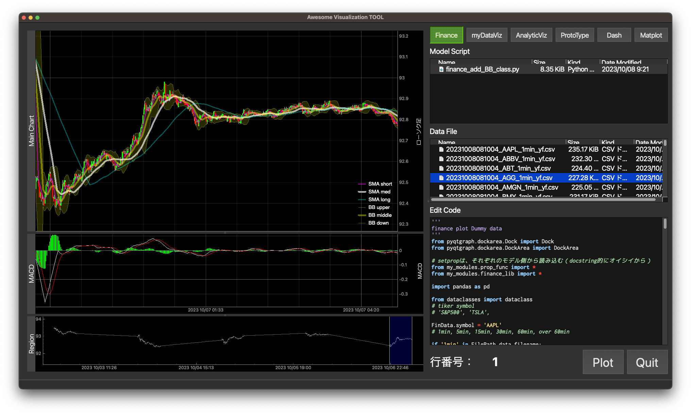

# finance_viz
データの可視化用のツールですが、以下のようにFinanceを中心としています。

Financeの他には、
- myDataViz
    - 自転車routeの探索用
    - SlowCookerの調理ログの表示
    - 献血記録の表示
- AnalyticViz
- ProtoType
- Dash
- Matplotlib

などがありますが、Analyticを除いてどれも中途です。（笑）
Finance関連を中心に触っておりまして、SlowCookerの調理ログ、自転車ルートの探索ツールの作業を進めるかんじで時間を使っていきます。

logには、作業記録として調べたことなどを入れます。

## Finance

[文字列に文字列が含まれるかを調べる](/log/search_word.md)

## Route

まだない

## SlowCooker

まだない

## Matplotlib

まだない

## Dash

まだない